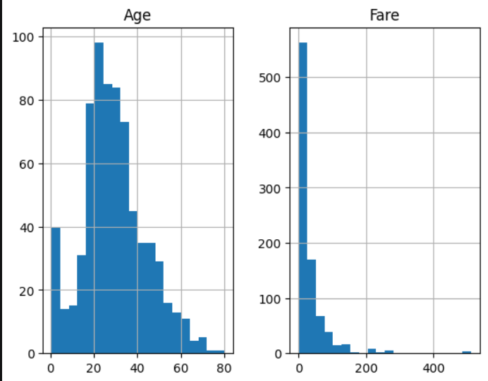
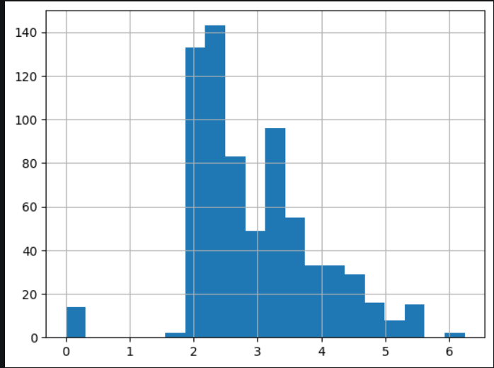

# My first kaggle comp - Titanic dataset
We all know that titanic dataset is the first ever kaggle competition of every beginner - there's nothing new about that!
hence, here I will be documenting my unfiltered approach to it, irrespective of how embarrasing it is.
## Grinding
### Algorithm #1 (AdaBoost)
To begin with the problem, I am using Adaboost algorithm, why? Because it works on almost every problem.

### Data Preprocessing
Here comes the part I hate and which is the core part of the Machine Learning. <br>
Firstly, I removed the columns Name, Ticket, Cabin. <br>
Now there are many missing values in this dataset, and to handle them, I dropped 2 rows which had missing values of Embarked feature. <br>
Now I have to fill missing values of the Age column, for that <b>KNN Imputer </b> would be the best option <br>

But before doing that, we have to go through the following steps - <br>
- Encoding the data - I use One Hot Encoding for that
- Scaling the data

Now finding the best suitable Scaler is important.
Feature 'Age' is almost bell shaped if we plot it, whereas 'Fare' is very skewed.
```
import matplotlib.pyplot as plt
df[['Age', 'Fare']].hist(bins=20)
plt.show()
```



hence, we apply log transformation to the 'Fare' feature, which makes the distribution bell curved again.

```
X_train['Fare'].hist(bins=20)
```



now that 'Age' and 'Fare' are normally distributed, we can apply <b> StandardScaler </b>. Hence, with that, our data is ready to be fed to the algorithm

